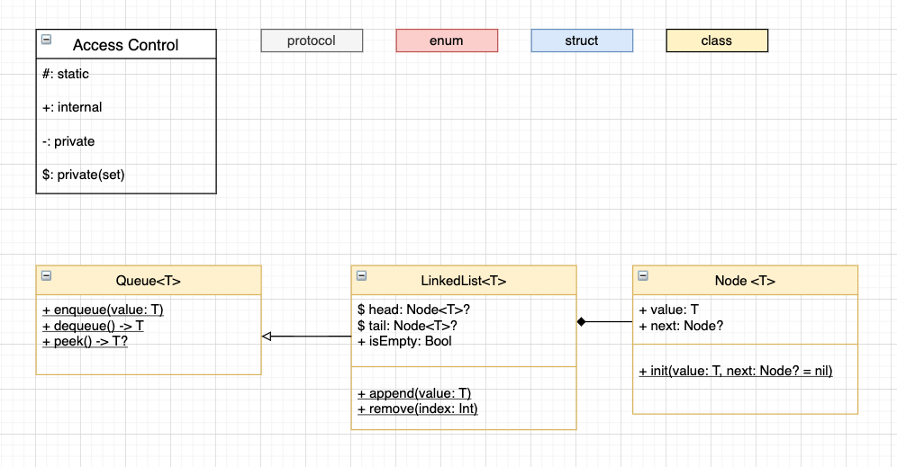
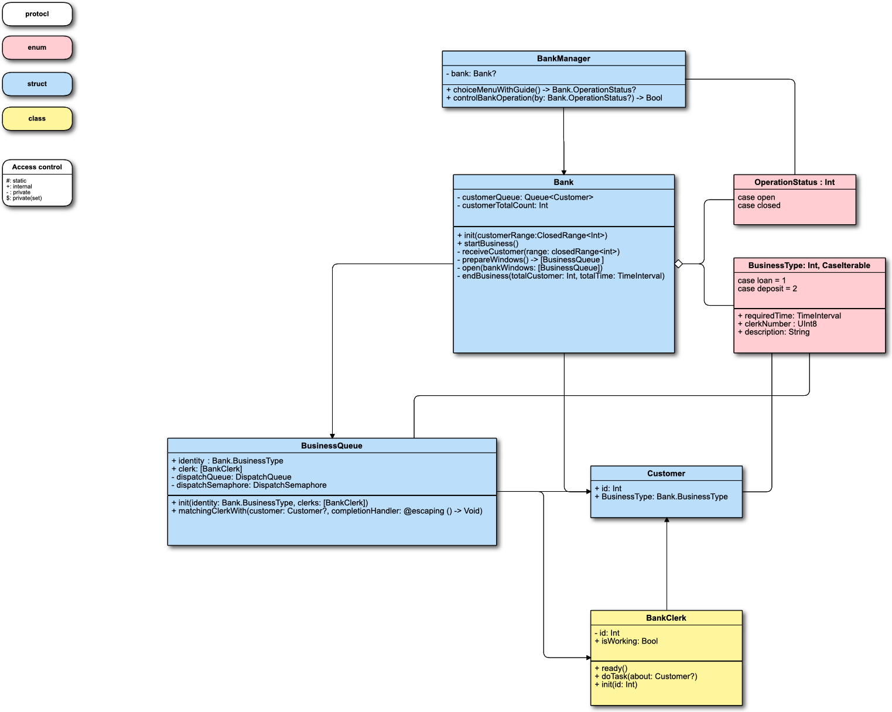

## iOS 커리어 스타터 캠프

# 은행 매니저 프로젝트 저장소
###  with 린, 예스코치, 수박(린과 아이들 ㅋㅋ)

---

### 𝞪. 이번 프로젝트를 통해 학습한 것
| Theme | Description |
|----------------|-------------------------|
| Automatic Reference Count, ARC | 먼저 메모리 영역을 공부했다. code, data, stack, heap 영역이 무엇이고, 각각 어떤 타입의 객체들이 올라가는지를 공부했다.   그리고 특히 동적으로 메모리가 할당되는 heap에서, reference type들이 어떻게 관리되는지를 공부했다.    strong reference cycle을 어떻게 회피할 것인지, week와 unowned의 차이가 무엇인지를 명확히 했다. |
| Type | 추상화, 일반화, 캡슐화, 은닉화에 대해 공부했다. 이전에 공부했던 내용이지만 정확히 모르고 있음을 인지하고 다시 공부를 했다. 다만 캡슐화가 추상화된 타입을 다듬고, 편의성을 위한 인터페이스를 새로 정의하는 점에서 이것도 추상화의 일부분으로 볼 것인지, 아니면 추상화를 넘어선 단계인지는 아직 잘 모르겠다 |
| Linekd-List | Array와 Linked-List의 특징들을 비교하며 공부했다.   단방향 노드를 통해 구현을 하였는데, 프로젝트를 진행하는 과정에서 Linked-list에 대한 첨삭이 필요한 상황이 생겼고, 여러가지 방법을 떠올린 것 중에 이것을 양방향 노드로 바꾸면 쉽게 해결할 수 있었다.   더 다양한 공부를 위해 동시성 프로그래밍과 로직을 통해 문제를 해결했지만, Linked-List의 특징을 잘 살릴려면 처음부터 양방향 노드로 구현을 하는 게 낫지 않을까 하는 생각이 들었다|
| Queue | 큐의 기본형을 공부하고, 앞서 공부한 Linked-List를 통해 이것을 구현했다 |
| sync / async task | 동기와 비동기에 대해 공부했다. X가 동작을 한 뒤 그 결과를 기다릴 것인지, 말 것인지... 말로는 한줄로 설명할 수 있지만 X와 Y, 그리고 그 동작이라고 하는 것의 관계에 대해 깊이 고민할 필요가 있음을 느꼈다 |
| Grand Central DispatchQueue | iOS에 동시성 프로그래밍을 구현하기 위한 객체. 동시성 프로그래밍은 thread를 통해 직접 구현할 수 있고, 옛날에는 그렇게 했다고 하지만, thread-safe하면서 동시성 프로그래밍에 대한 인터페이스를 제공하는 GCD는, 안쓰기에는 너무 매력적인 객체이다 |
| serial / concurrent programming | 직렬과 병렬, 병렬과 동시를 조금 구분할 필요가 있다. 직렬은 줄지어 서는 것, 병렬은 나란히 서는 것. 이것은 특히 물리적인 개념으로, 특히 병렬성은 물리적인 스레드에 대해 이야기할 때 사용되는 표현이다. 동시는 실제로 동시건 아니건, 인간이 느끼기에 동시에 동작을 하면 동시성 프로그래밍이라고 표현할 수 있다.   단일코어 단일스레드라고 해도, 시분할 방식으로 돌아가는 os가 동시성 프로그래밍의 큰 예시이다.   위의 내용들과 이 내용을 조합해서 필요한 것만 간추리면, GCD는 serial한 큐와 concurrent한 큐를 지원하고, 각각의 큐에 sync와 async한 task를 올릴 수 있다.|

|프로젝트를 시작하기 전 가정한 자료구조 UML|
|---|
||

|프로젝트를 되돌아보며 정리한 은행 관련 모델 UML|
|---|
||

 

---

 

### 𝞫. 프로젝트를 진행하며 겪었던 문제들

|problem|solution|
|-----|-----|
|콘솔앱을 만드는 과정에서, Timer.scheduleTimer와 GCD.async와 같이 task를 예약을 하는 경우, 이러한 내용들이 실행이 되지 않고 종료가 되었다.|처음에는 무슨 일인지도 모르고 구글링을 하여 Runloop.main.run() 과 같은 해법을 찾았으나, 돌이켜보면 메인 스레드가 해당 내용들을 비동기로 돌렸기 때문에, 내용을 기다리지 않고 다음 작업을 넘어가다가... 더이상 할 작없이 없어서 종료가 된 것이었다.|
|테스트 프로젝트에서, 코드 레벨에서는 정확히 import가 되어 컴파일러가 인식하고 있음에도, 테스트 실패가 아니라 크래시(😩)가 났다| 에러 로그를 읽어보던 도중, Link라는 키워드와 Symbol not found 라는 키워드가 눈에 들어왔다.   LLDB를 공부하기에 앞서 LLVM을 공부하던 과정에서, Link라는 키워드를 접했던 기억을 떠올렸다. 빌드 과정에 소스 코드를 모으고 연결하는 과정이라고 했던 기억이 어렴풋이 났다. 여기서 연결하기에 앞서, 소스 코드를 모으는 과정에서, 즉 import 과정에서 오류가 난 것 같다는 짐작을 했다   이러한 전제를 바탕으로 구글링을 하는 과정에서 dependency와 같은 용어를 접하게 됐다. 이후 XCode의 인터페이스를 통해 파일의 레퍼런스를 강제로 주입하는 것을 찾아볼 수 있었고, 이를 통해 문제를 해결할 수 있었다. 다만 아직까지도 왜 임포트가 제대로 되지 않았었는지는... 수수께끼다...|
|Queue와 LinkedList의 관계에 대한 고민, LinkedList에 대해 의존하게 만들지, 이것을 상속할지...| 처음에는 의존을 하는 형태로 구현을 했다가, 공부를 했던 내용과 코드로 구현된 내용에 괴리감을 느끼고 조원과 합의하여 다시 상속으로 코드를 고쳤었다.   하지만 이렇게 할 경우, Queue를 사용할 때에 node가 은닉화가 되지 않는 치명적인 오류가 있었다. 상속을 하면서 접근제어자를 바꿀 수 있는지 확인하고 시도해보려고 했으나, 마땅한 해답을 찾지 못하고 안된다는 이야기만 들은 후, 다시 적절한 은닉화를 위해 LinkedList를 의존하는 형태로 바꾸었다|
|프로젝트 초기, 각각의 은행원은 자신의 일이 끝난 뒤에 새로운 일을 시작해야 했으나 다양한 에러가 있었다. 처음에 다같이 일을 전부 시작한다던지, 어떤 일을 끝내기 전에 새로운 일을 시작한다던지...| 동기-비동기, 직렬-동시에 대한 개념을 몰라서 그랬던 것이었다... |
| 또 뭐가 있었지 | ~~~ |

 

---

 

### 𝞈. 남겨진 고민들...

1. <U>프로젝트를 되돌아보며 정리한 은행 관련 모델 UML</U>을 보면 알 수 있듯이, 관계가 매우 복잡하다. 특히 Bank의 nested enum인 BusinessType이 이곳저곳에서 사용되면서, 결국엔 Bank를 거쳐야만 하게 되어 내용이 아주 복잡해지고, Bank도 무거워지게 되었다. 이 enum은 따로 분리를 하는 게 좋아보이지만, 같이 작성해온 코드를 혼자 마음대로 하는 것이 조금 조심스러워 리드미를 작성하면서도 일단은 킵해두었다... 
 
1. Dispatch와 관련된 내용들을 모두  BusinessQueue에서 은닉화를 하고 싶었으나, DispatchGroup 만큼은 Bank에서 사용을 하게 남겨져 있었다. 고쳐보고 싶다... 
 
1. Bank에서는 창구Window라고 표현하는 것이 BusinessQueue라는 타입인데, 결국 각각의 창구는 한명의 은행원이 한 종류의 task만 수행을 할 수 있게 되어있다. 현실세상과는 조금 다른 것이 아닌가? 좀 더 개선할 여지가 있는 것이 아닌가? 하는 의문이 있다 
 
1. Bank에서 Customer에게 어떤 need를 가지고 있는지를 설정하고 있는데, 린도 말씀을 해주셨던 것처럼 이것은 아주 기이한 일이라고 할 수 있다... 고객이 자신의 일을 몰라서 은행이 주입을 해준다는 게... 이것도 개선할 여지가 있다고 생각된다.