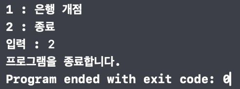

## 은행창구 매니저 🏦👩‍💼🧑‍💼

### 0. 목차
- [1. 소개](#1-소개)
- [2. 실행 화면](#2-실행-화면)
- [3. UML](#3-UML)
- [4. 트러블 슈팅](#4-트러블-슈팅)
- [5. 팀원](#5-팀원)
- [6. 팀 회고](#6-팀-회고)
- [7. 타임라인](#7-타임라인)
- [8. 참고 자료](#8-참고-자료)   

### 1. 소개
사용자의 입력에 따라서 은행 업무를 처리하는 콘솔앱 프로그램입니다. <br/>사용자가 1을 입력하면 은행이 개점하고, 1명의 은행원이 근무하여 10~30명의 고객에 대해 업무를 처리합니다. <br/> 고객 1명 당 소요 업무 시간은 0.7초이며, 한 번에 처리할 수 있는 고객도 1명입니다.<br/> 사용자가 2를 입력하면 프로그램이 종료됩니다.

### 2. 실행 화면
| 실행 초기 화면 | 메뉴에 없는 입력을 했을 때 |
| --- | --- |
|  |   |

| 메뉴 1을 입력했을 때(은행 개점) | 메뉴 2를 입력했을 때(종료) |
| --- | --- |
|  |  |

### 3. UML


### 4. 트러블 슈팅
__1. Node를 클래스로, LinkedList와 Queue를 구조체로 선언한 이유__  
- BankNode를 처음에 구조체로 선언했을 때 다음과 같은 오류가 발생했습니다.
`Value type 'BankNode<T>' cannot have a stored property that recursively contains it`
구조체는 값 타입으로 자기 자신이 타입인 저장 프로퍼티를 가질 수 없다는 내용의 오류였습니다. 값 타입은 구조가 고정적이고 메모리 안에서 공간 또한 한정적입니다. 메모리 공간을 얼마나 확보해야 하는지를 컴파일 타임에 반드시 알아야 하는데, 재귀적으로 자신의 타입을 프로퍼티로 가지게 된다면 메모리 공간이 얼마나 필요한지 계산할 수 없습니다. 따라서 자기 자신이 타입인 프로퍼티를 가지기 위해서는 클래스로 선언해야 하고, 클래스로 선언함으로써 오류를 해결할 수 있었습니다. 
- 기본적으로 구조체와 클래스 중에서 클래스를 사용할 이유가 없다면 구조체로 선언하도록 스위프트는 권장합니다. LinkedList와 Queue는 값 타입인 구조체로 선언해야, 인스턴스를 복사하거나 할당할 때 인스턴스의 참조가 공유되면서 내부 값이 동일하게 변경되는 상황 등을 방지하여 각각의 고유성을 보장할 수 있습니다. 즉, 구조체로 선언함으로써 개별적인 컨테이너이자 타입으로 동작할 수 있습니다. 또한 상속이나 Objective-C와의 상호작용이 현 스탭에서는 필요 없다고 생각하기 때문에 구조체로 선언하게 되었습니다.

__2. LinkedList의 removeAll() 메소드 구현 방식__
```Swift
mutating func removeAll() {
    head = nil
    tail = nil
}
```
LinkedList에서 removeAll() 메소드를 구현하는 방식에 대해서 팀원 간 논의를 하게 되었습니다. head에 nil을 할당하는 것만으로도 모든 Node들이 메모리에서 제거가 된다는 입장에서는 head 다음 Node를 참조하는 접근 주소를 잃게되어 head와 tail 중간 Node들은 메모리에서 해제된다고 생각했습니다. 따라서 중간 Node는 삭제해주지 않아도 된다고 보았습니다.
다음처럼 중간에 있는 Node들에도 nil을 할당해야 모든 Node들이 메모리에서 해제가 된다는 입장에서는 head와 tail만 메모리에서 제거한다면, 중간에 연결된 Node들은 여전히 참조 카운트가 0이 아니기 때문에 자동으로 해제되지 않는다고 보았습니다. 따라서 while문을 통해 head부터 tail까지 nil을 할당하여 메모리에서 해제해줘야 모든 노드가 완전히 삭제된다고 생각했습니다.
```Swift
func removeAll() {
    var currentNode = head
    while currentNode != nil {
        let nextNode = currentNode.next
        currentNode.next = nil
        currentNode = nextNode
    }
}
```
Node에 Deinit 함수를 이용하여 디버깅을 한 결과, head와 tail에 nil을 할당해주는 방법으로도 모든 Node가 메모리에서 해제되는 것을 확인할 수 있었습니다.

### 5. 팀원
| [Gray](https://github.com/yawoong2) | [Gama](https://github.com/forseaest) |
| --- | --- |
|  |  |

### 6. 팀 회고
#### 우리팀이 잘한 점 😍
- Gray 
  - 짝 프로그래밍 시간 전에 미리 공부해야할 사항들을 정하고 준비하는 시간을 가진 것이 좋았습니다. 예습 복습을 하는 느낌이어서 깊이있게 코드를 이해할 수 있었습니다.
- Gama
  - 그라운드 룰을 세세하게 작성하고 프로젝트를 시작하여 상황들에 대해서 보다 신속하게 대처할 수 있었습니다.
#### 우리팀 개선할 점 🥲
- Gray
  - 코드에 궁금증이 생겼을때 충분한 실험을 통해 깨닫는 것이 중요하다고 느꼈습니다.
- Gama
  - 모듈화에 대한 공부와 실험 등이 이루어져야 할 것 같습니다.

### 7. 타임라인
| 날짜 | 제목 |
| --- | --- |
| 24.03.18(월) | BankManager 모듈 내에 LinkedList를 이용한 Queue 구현 |
| 24.03.19(화) | BankQueue 유닛 테스트, 코드 리팩토링 |
| 24.03.20(수) ~ 03.21(목) | 방문 고객 수만큼 업무를 처리하여<br/> 총 업무시간을 반환하는 은행 업무 처리 콘솔앱 구현 |
| 24.03.22(금) | 코드 리팩토링, README 작성 |

### 8. 참고 자료
- https://babbab2.tistory.com/87
- https://www.appypie.com/struct-vs-class-swift-how-to
- https://siwon-code.tistory.com/15
- https://velog.io/@haze5959/mutating-struct-VS-class-성능-테스트
